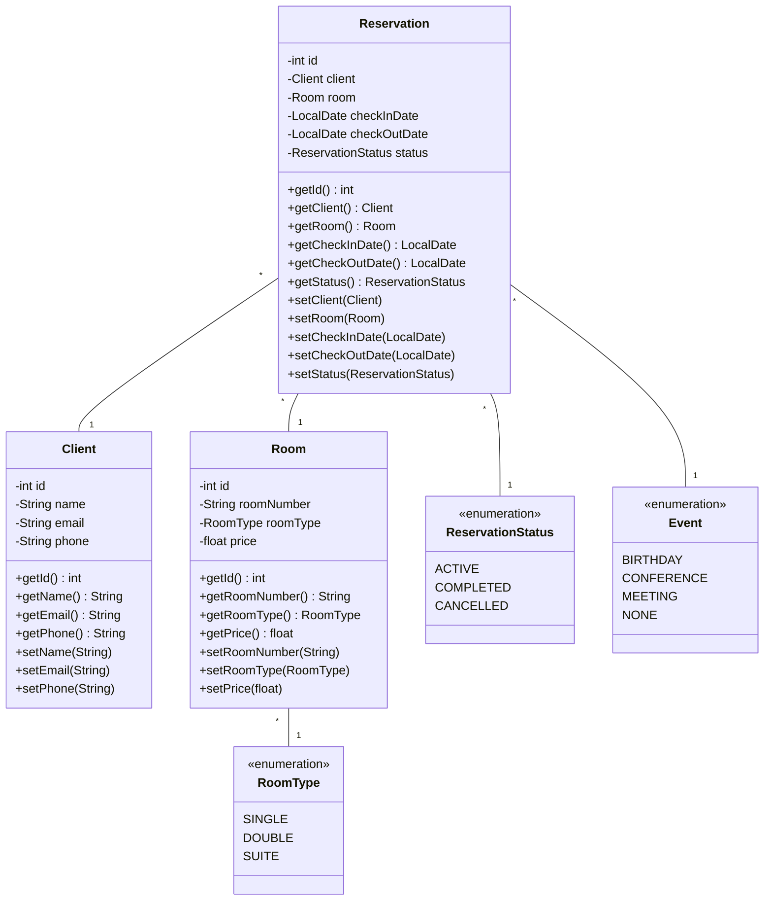

# Hotel Reservation System - CLI

Ce projet vise à développer une application console en Java pour gérer les réservations d'hôtel. L'application devra inclure des fonctionnalités avancées pour la gestion des réservations, l'affichage des détails, la vérification de la disponibilité des chambres, et des rapports statistiques. Elle doit également respecter des exigences techniques précises telles que l'utilisation de l'héritage, du polymorphisme, des collections, et des streams en Java.

## Diagramme de Classes

## Objectifs

Développer une application console robuste pour la gestion des réservations d'hôtel. Implémenter des fonctionnalités avancées telles que les rapports statistiques, les règles de tarification dynamiques, et l'intégration d'une base de données PostgreSQL. L'application doit être organisée en couches (Service, etc.), utiliser des design patterns (Singleton, Repository Pattern), et appliquer des concepts avancés de Java comme les Streams, les Optionals, et les Enums. Une version ultérieure du projet devra intégrer JDBC et Java Streams.

## Périmètre du Projet

### Gestion des Réservations 

- Création de Réservation : Permettre aux utilisateurs de créer de nouvelles réservations avec des détails tels que la date d'arrivée, la date de départ, le type de chambre.

- Modification de Réservation : Offrir la possibilité de modifier les réservations existantes, y compris la possibilité de changer les dates ou le type de chambre.

- Annulation de Réservation : Gérer les annulations de réservations en respectant les politiques d'annulation (remboursement partiel ou complet selon les délais).

### Affichage des Détails de Réservation

- Consultation des Données : Afficher les informations complètes de chaque réservation, incluant les détails du client, les préférences de chambre, et les notes spéciales.

- Interface Console Claire : Utiliser une présentation structurée pour faciliter la lecture et la compréhension des données.

### Gestion des Chambres :

- Vérification de la Disponibilité : Permettre la vérification en temps réel de la disponibilité des chambres en utilisant des collections Java adaptées (par exemple, HashMap).

### Gestion des Tarifs 

- Tarification Dynamique : Implémenter des règles de tarification dynamiques basées sur la saison, les jours de la semaine, et les événements spéciaux.

### Statistiques 

- Rapports de Réservation : Calculer et affic

### Exigences Techniques 

- Diagramme de classes : Les apprenants devront réaliser un diagramme de classes incluant au moins 4 classes, illustrant l'usage de l'héritage et du polymorphisme.

- Utilisation des Collections et HashMaps : Pour organiser et gérer les données de manière efficace.

- Streams et Optionals : Pour le traitement et la manipulation des données de manière fluide et sécurisée.

- Enums : Pour la gestion des constantes et des types définis.

- Base de Données PostgreSQL : Intégration d'une base de données relationnelle pour le stockage des données.

- Design Patterns : Implémentation du Singleton et du Repository Pattern pour une architecture logicielle solide.

- Organisation en Couches : Application structurée en différentes couches (Service, etc.) pour une meilleure maintenabilité. Validation des Données : Notamment la validation des dates et d'autres champs critiques.
